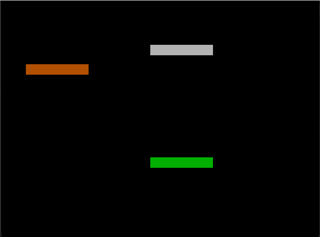
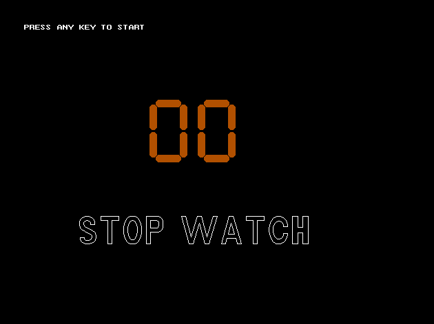
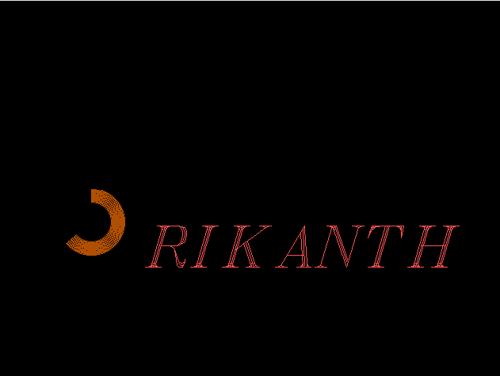

# simple animation projects using Graphics.h
ThisaRepository includes all the fun stuff that we can do with graphics.h( standard c library )

Submitted by: **Srikanth Reddy Mallepally**

Time spent: **150** hours spent in total

# Instructions to run this game:

1. Install turboc or devc++ compiler.
2. In turboc3 or(turboc4) compiler c:TurboC++\Disk\TurboC3\BGI
3. Similarly in an other compiler also go to bgi folder and copy the code file.
4. Run the code

## Features

## list of Animation Programs with gif video walkthrough.
1. Exit Animation: the Exit animation is a show end cutrains animation.
    Video Walkthrough
   
    
2. Flag Animation: the flag animation shows the how the indian flag is hoisted for republic day celebrations.
    Video Walkthrough
   
    
3. StopWatch: Its a counter for 1 to 10 numbers.
    Video Walkthrough
   
    
4. logo Animation: all the three Operating systems logos such as the Andriod, Ubuntu and Windows is showed in this animation
    Video Walkthrough
   
5. name animation: my name animation using arc function.
    Video Walkthrough
   

   
## License

    Copyright [2015] [Srikanth Reddy Mallepally]

    Licensed under the Apache License, Version 2.0 (the "License");
    you may not use this file except in compliance with the License.
    You may obtain a copy of the License at

        http://www.apache.org/licenses/LICENSE-2.0

    Unless required by applicable law or agreed to in writing, software
    distributed under the License is distributed on an "AS IS" BASIS,
    WITHOUT WARRANTIES OR CONDITIONS OF ANY KIND, either express or implied.
    See the License for the specific language governing permissions and
    limitations under the License.

